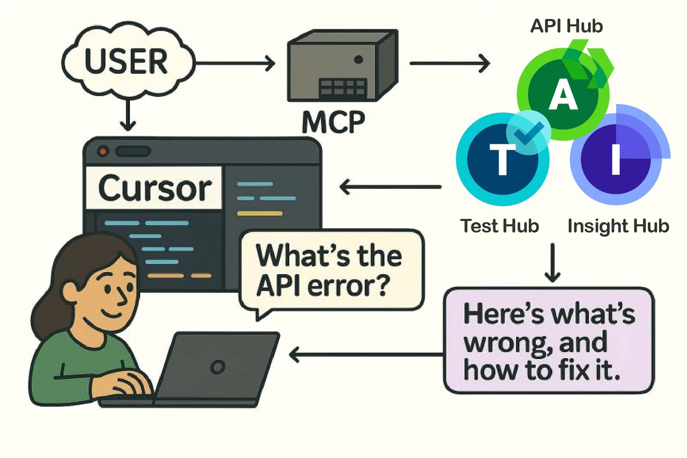

> ⚠️ The SmartBear MCP Server is under active development and features may change. Check our [GitHub repository](https://github.com/SmartBear/smartbear-mcp) for the latest updates and compatibility information.

The SmartBear MCP Server enables a secure and intelligent bridge between SmartBear platform data and AI-powered development workflows. By leveraging the [Model Context Protocol (MCP)](https://modelcontextprotocol.io/introduction), it allows developers to access rich context and capabilities---such as API definitions, governance rules, portal documents, test outcomes, error reports, monitoring insights, and debugging diagnostics---directly within their preferred AI assistants and IDEs.

By surfacing actionable context from across API Hub, Test Hub, and Insight Hub into tools like GitHub Copilot, Cursor, Claude, and other MCP-compatible clients, the MCP Server empowers teams to accelerate design, testing, and troubleshooting workflows---all while keeping developers within their natural flow of work.

This integration empowers development teams to accelerate troubleshooting workflows by bringing rich contextual data from Insight Hub directly into their development conversations with AI tools like GitHub Co-Pilot, Cursor, Claude, and other MCP-compatible clients.

Here's a quick example of the power we're bringing to your AI development experiences. In this demo, we showcase how you can solve a real software bug using the our Insight Hub tools combined with GitHub Co-pilot:

See our full capabilities [here](./mcp-server-capabilities).

## What is the Model Context Protocol?

The Model Context Protocol (MCP) is an open standard that enables secure, structured communication between AI applications and external data sources. It allows Large Language Models (LLMs) to access real-time data and perform actions while maintaining security and context boundaries.

Key benefits of MCP include:

-   Secure data access - Controlled, authenticated access to sensitive debugging data
-   Real-time context - Fresh data from your applications and services
-   Standardized interface - Works across multiple AI clients and platforms
-   Tool integration - Enables AI to perform actions, not just read data